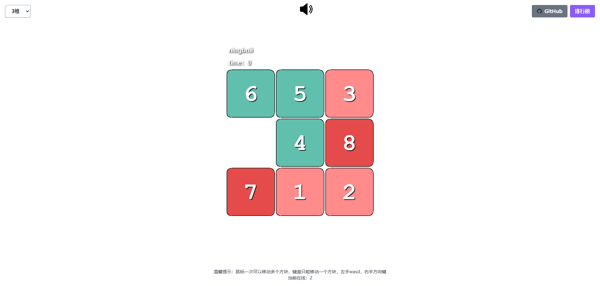

# 数字华容道小游戏

这是一个基于 Vite5、Vue3 和 Phaser3 开发的数字华容道小游戏。玩家需要通过移动数字方块来完成拼图，挑战自己的逻辑思维能力。



## 试玩地址

[点击这里试玩](https://digital.wxbuluo.com)

## 安装测试

```
// 进入目录
yarn
// 启动server
yarn dev
// 打包
yarn build
```